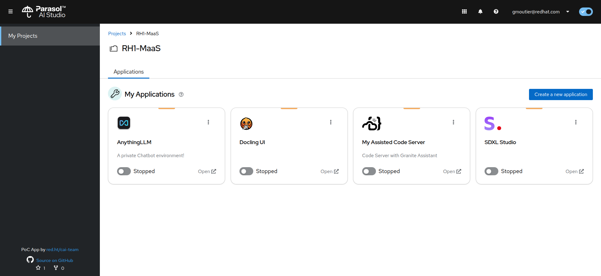
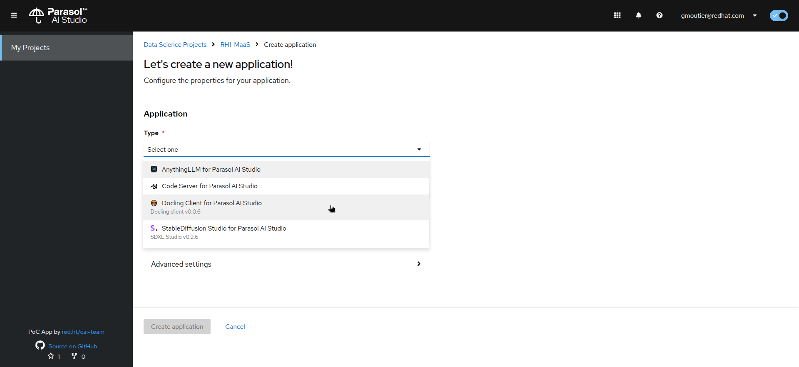

# Parasol AI Studio

A spin on the Open Data Hub/OpenShift AI dashboard. The goal is to make it as simple as possible for anyone to quickly instantiate and use AI-enabled applications without having to know anything about AI, models, APIs,...

Currently showcased applications (which are behind the scene OpenShift AI custom Workbenches) are:

- [AnythingLLM](https://github.com/rh-aiservices-bu/llm-on-openshift/tree/main/llm-clients/anythingllm)
- [Docling Serve UI](https://github.com/rh-aiservices-bu/llm-on-openshift/tree/main/tools/docling-serve-ui-workbench)
- [Code Server with Continue.dev plugin](https://github.com/rh-aiservices-bu/parasol-code-server)
- [Stable Diffusion XL Studio](https://github.com/rh-aiservices-bu/image-generation-on-openshift/tree/main/sdxl/sdxl-studio/client)

All these applications are automatically consuming AI models through the APIs of a fully integrated [Models-as-a-Service](https://github.com/rh-aiservices-bu/models-aas) environment. Accounts are automatically provisioned and tokens generated, without needing the user to know it even happens.

## Architecture/Flow

The flow for creating a new application is pretty simple:

1. The user selects which application they want to use, giving it a name.
2. Parasol AI Studio backends executes different queries to the Models-as-a-Service (MaaS) API, using the username, the selected model (determined by the application they chose), and the name of the application entered by the user:
   - If the user does not exists in MaaS, it is created.
   - If the application name already exists for this user, the existing token is retrieved.
   - If the application does not exist in MaaS, it is created and the corresponding token is sent back.
3. Now that the Parasol AI Studio backend has all the needed information (model, endpoint, token,...), it creates a new Workbench of the requested type (AnythingLLM, Docling,...), injecting this information as environment variables. Those variables are used to properly configure the Workbench instance at startup (exact process depends on the type).
4. The Application (Workbench) can now consume the model from MaaS, using its token to authenticate itself.

## Screenshots

- Applications launcher, easy-to-use UI

- Application creation, with minimal information needed

